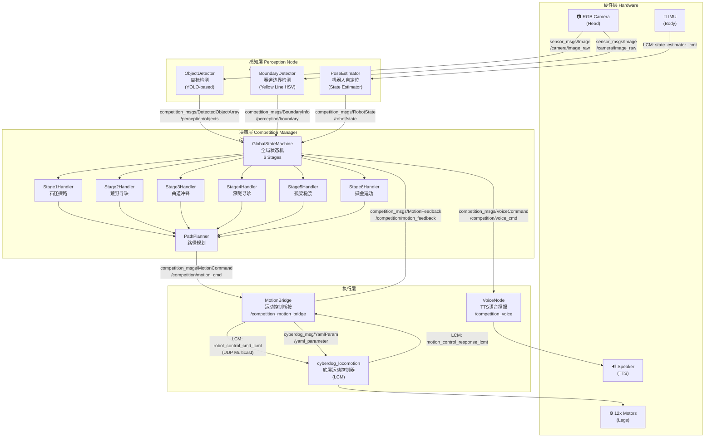
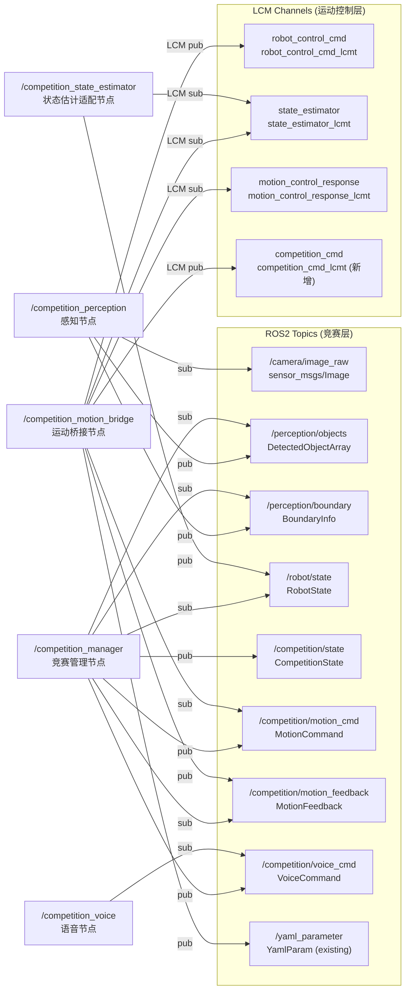

# 荒野寻宝竞赛系统 — 顶层架构设计

> 2026年全国大学生计算机系统能力大赛（小米杯）CyberDog 竞赛系统  
> 平台：CyberDog 四足机器人 + ROS2 Humble + LCM

---

## 一、系统边界（System Boundaries）

```
┌─────────────────────────────────────────────────────────────────────┐
│                        竞赛系统（Competition System）                 │
│                                                                     │
│  ┌──────────────┐  ┌──────────────┐  ┌──────────────────────────┐  │
│  │  感知层       │  │  决策层       │  │  执行层                   │  │
│  │ Perception   │  │  Decision    │  │  Execution               │  │
│  │              │  │              │  │                          │  │
│  │ ·目标检测     │  │ ·全局状态机   │  │ ·运动控制桥接             │  │
│  │ ·边界识别     │  │ ·赛段任务规划 │  │ ·LCM→运动控制器          │  │
│  │ ·障碍物检测   │  │ ·路径规划     │  │ ·语音TTS输出             │  │
│  └──────┬───────┘  └──────┬───────┘  └──────────┬───────────────┘  │
│         │   ROS2 Topics   │   ROS2 Topics        │ LCM              │
└─────────┼─────────────────┼──────────────────────┼──────────────────┘
          │                 │                      │
   ┌──────▼──────┐   ┌──────▼──────┐      ┌───────▼────────────────┐
   │  RGB Camera  │   │  Stage FSM  │      │  cyberdog_locomotion    │
   │  (机器人头部) │   │  竞赛状态机  │      │  (底层运动控制器 LCM)   │
   └─────────────┘   └─────────────┘      └────────────────────────┘
```

**系统外部接口：**
| 接口 | 方向 | 协议 | 说明 |
|------|------|------|------|
| RGB Camera | 输入 | ROS2 `sensor_msgs/Image` | 机器人头部摄像头 |
| IMU & 状态估计 | 输入 | LCM `state_estimator_lcmt` | 机体位姿、速度 |
| 运动控制命令 | 输出 | LCM `robot_control_cmd_lcmt` | 步态/速度指令 |
| 运动控制响应 | 输入 | LCM `motion_control_response_lcmt` | 执行状态反馈 |
| 参数配置 | 双向 | ROS2 `cyberdog_msg/YamlParam` | 运行时参数 |
| 语音输出 | 输出 | ROS2 `competition_msgs/VoiceCommand` | TTS播报 |

---

## 二、顶层架构图（Top-Level Architecture Diagram）



---

## 三、节点通信图（Node Communication Graph）



---

## 四、全局状态机（Global State Machine）

```mermaid
stateDiagram-v2
    [*] --> IDLE : 系统启动

    IDLE --> STAGE1_INIT : 比赛开始信号
    
    state STAGE1["赛段一：石径探路"] {
        STAGE1_INIT --> S1_STANDUP : 起身
        S1_STANDUP --> S1_FORWARD : 站立完成
        S1_FORWARD --> S1_TURN : 检测到弯道
        S1_TURN --> S1_EXIT : 转向完成
    }

    STAGE1 --> STAGE2_INIT : 后腿离开弯道虚线

    state STAGE2["赛段二：荒野寻珠"] {
        STAGE2_INIT --> S2_SCAN : 开始扫描
        S2_SCAN --> S2_APPROACH : 发现橙色球
        S2_APPROACH --> S2_HIT : 到达击打距离
        S2_HIT --> S2_SCAN : 球晃动确认，继续寻找
        S2_SCAN --> S2_EXIT : 所有目标完成
    }

    STAGE2 --> STAGE3_INIT : 后腿离开出口虚线

    state STAGE3["赛段三：曲道冲锋"] {
        STAGE3_INIT --> S3_NAVIGATE : 边界跟踪行进
        S3_NAVIGATE --> S3_CURVE_L : 检测左弯
        S3_NAVIGATE --> S3_CURVE_R : 检测右弯
        S3_CURVE_L --> S3_NAVIGATE : 转弯完成
        S3_CURVE_R --> S3_NAVIGATE : 转弯完成
        S3_NAVIGATE --> S3_EXIT : 到达出口
    }

    STAGE3 --> STAGE4_INIT : 后腿离开弯道虚线

    state STAGE4["赛段四：深隧寻珍"] {
        STAGE4_INIT --> S4_EXPLORE : 进入横向通道
        S4_EXPLORE --> S4_AVOID_BAR : 检测到限高杆
        S4_EXPLORE --> S4_AVOID_OBS : 检测到无法跨越障碍
        S4_EXPLORE --> S4_INTERACT_COLA : 检测到可乐瓶
        S4_EXPLORE --> S4_INTERACT_BALL : 检测到橙色球
        S4_EXPLORE --> S4_INTERACT_SOCCER : 检测到足球
        S4_AVOID_BAR --> S4_EXPLORE : 低姿通过
        S4_AVOID_OBS --> S4_EXPLORE : 绕行完成
        S4_INTERACT_COLA --> S4_EXPLORE : 击倒完成
        S4_INTERACT_BALL --> S4_EXPLORE : 晃动完成
        S4_INTERACT_SOCCER --> S4_EXPLORE : 射门完成
        S4_EXPLORE --> S4_EXIT : 三个任务完成，找到独木桥
    }

    STAGE4 --> STAGE5_INIT : 前腿触碰独木桥起始端

    state STAGE5["赛段五：孤梁稳渡"] {
        STAGE5_INIT --> S5_BEAM_WALK : 上桥行走
        S5_BEAM_WALK --> S5_PASS_LINE : 四足越过虚线
        S5_PASS_LINE --> S5_JUMP : 跳下动作
    }

    STAGE5 --> STAGE6_INIT : 成功跳下

    state STAGE6["赛段六：撷金建功"] {
        STAGE6_INIT --> S6_KICK : 踢球出口
        S6_KICK --> S6_NAVIGATE : 向终点移动
        S6_NAVIGATE --> S6_LIEDOWN : 四足在圈内趴下
    }

    STAGE6 --> FINISHED : 趴下完成

    FINISHED --> [*]

    IDLE --> ERROR : 硬件异常
    STAGE1 --> ERROR : 严重跌倒
    STAGE2 --> ERROR : 严重跌倒
    STAGE3 --> ERROR : 严重跌倒
    STAGE4 --> ERROR : 严重跌倒
    STAGE5 --> ERROR : 严重跌倒
    STAGE6 --> ERROR : 严重跌倒
    ERROR --> RECOVERY : 自动恢复
    RECOVERY --> IDLE : 恢复成功
```



---

## 五、软件包结构（Package Structure）

```
src/
├── cyberdog_locomotion/          # 已有：底层运动控制（LCM）
│   └── common/lcm_type/lcm/
│       └── competition_cmd_lcmt.lcm    # 新增：竞赛指令LCM类型
│
└── cyberdog_simulator/           # 已有：仿真相关包
    ├── competition_msgs/         # 新增：竞赛消息定义包
    │   ├── msg/
    │   │   ├── CompetitionState.msg
    │   │   ├── DetectedObject.msg
    │   │   ├── DetectedObjectArray.msg
    │   │   ├── BoundaryInfo.msg
    │   │   ├── RobotState.msg
    │   │   ├── MotionCommand.msg
    │   │   ├── MotionFeedback.msg
    │   │   └── VoiceCommand.msg
    │   ├── CMakeLists.txt
    │   └── package.xml
    │
    ├── competition_manager/      # 新增：竞赛管理（全局状态机）
    │   ├── include/competition_manager/
    │   │   ├── global_state_machine.hpp
    │   │   ├── stage_handler_base.hpp
    │   │   └── stages/
    │   │       ├── stage1_stone_path.hpp
    │   │       ├── stage2_ball_hunt.hpp
    │   │       ├── stage3_curved_track.hpp
    │   │       ├── stage4_deep_tunnel.hpp
    │   │       ├── stage5_balance_beam.hpp
    │   │       └── stage6_final_goal.hpp
    │   ├── src/
    │   │   ├── competition_manager_node.cpp
    │   │   ├── global_state_machine.cpp
    │   │   └── stages/
    │   │       ├── stage1_stone_path.cpp  ... stage6_final_goal.cpp
    │   ├── CMakeLists.txt
    │   └── package.xml
    │
    ├── competition_perception/   # 新增：感知节点
    │   ├── include/competition_perception/
    │   │   ├── object_detector.hpp
    │   │   └── boundary_detector.hpp
    │   ├── src/
    │   │   ├── perception_node.cpp
    │   │   ├── object_detector.cpp
    │   │   └── boundary_detector.cpp
    │   ├── CMakeLists.txt
    │   └── package.xml
    │
    ├── competition_motion_bridge/ # 新增：运动桥接节点
    │   ├── include/competition_motion_bridge/
    │   │   └── motion_bridge.hpp
    │   ├── src/
    │   │   └── motion_bridge_node.cpp
    │   ├── CMakeLists.txt
    │   └── package.xml
    │
    └── competition_voice/        # 新增：语音TTS节点
        ├── src/
        │   └── voice_node.cpp
        ├── CMakeLists.txt
        └── package.xml
```
